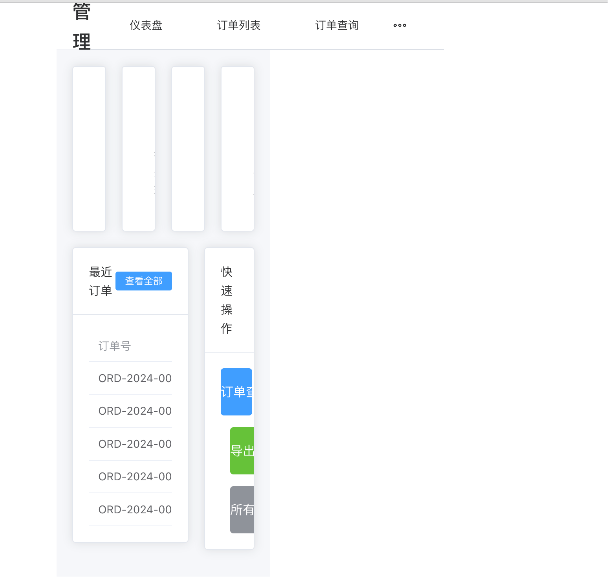
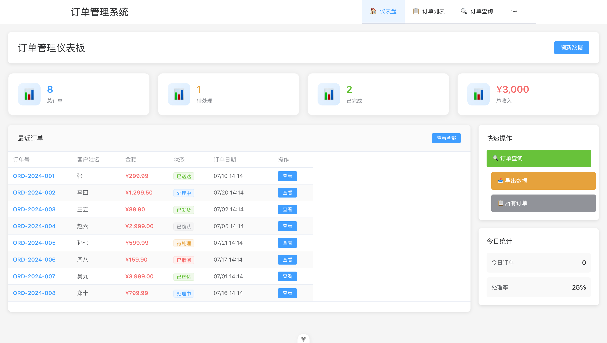
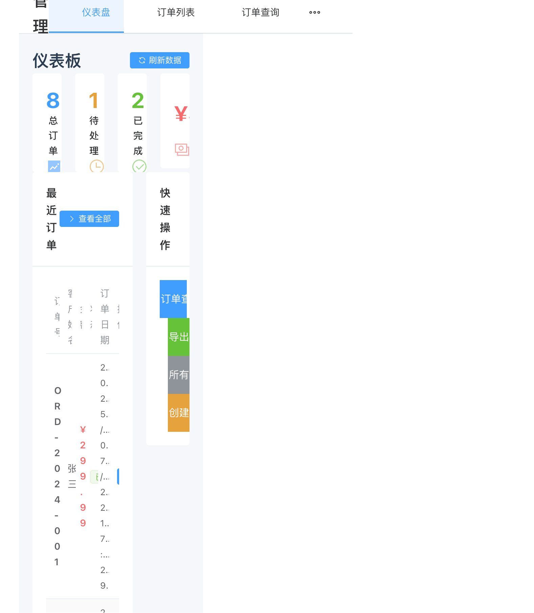
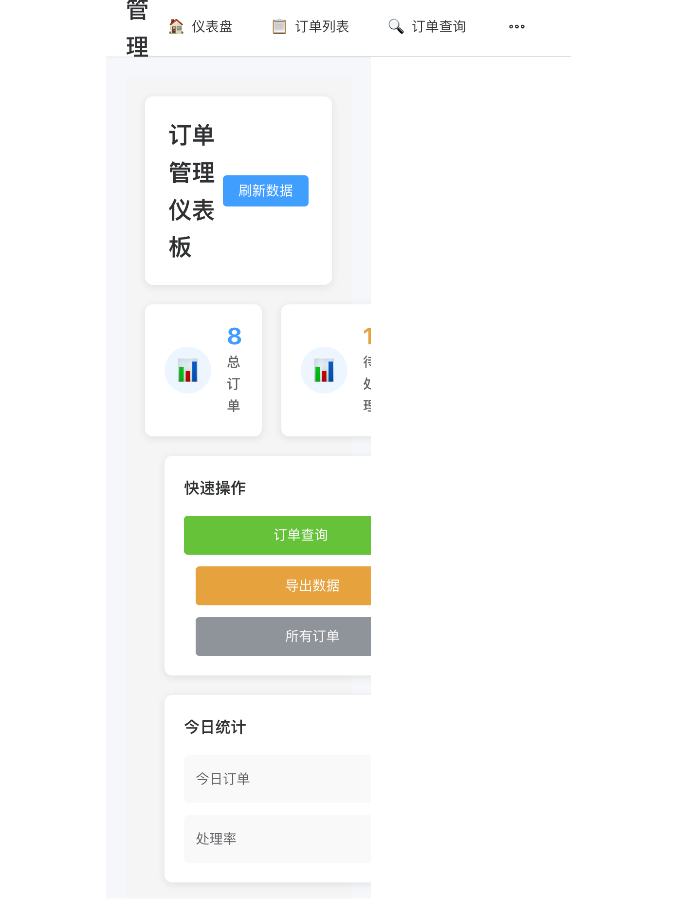
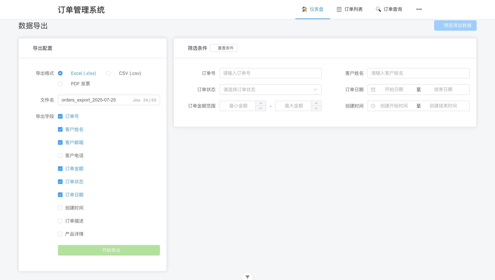
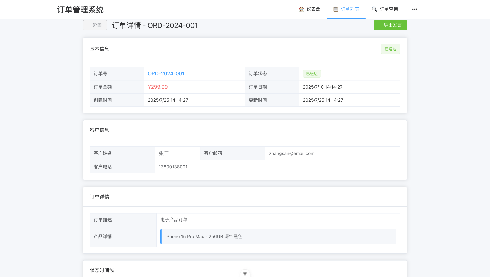
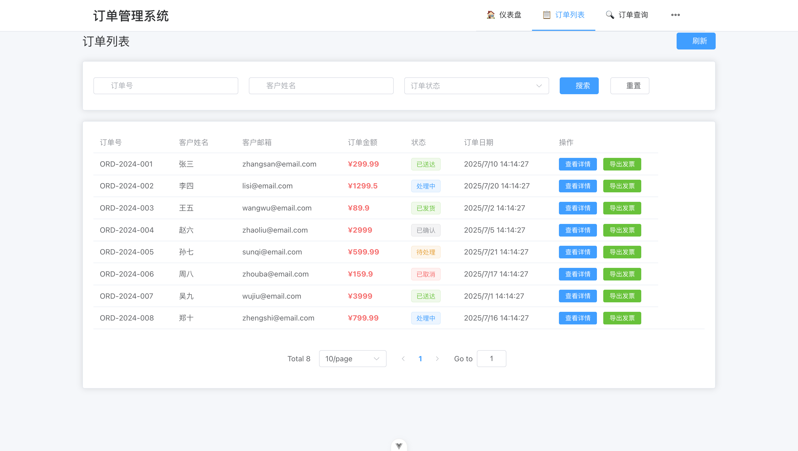

# 订单管理系统 - Claude Code 能力验证 DEMO

## 项目简介

这是一个专门为验证 **Claude Code** 能力而开发的全栈订单管理系统 DEMO 项目。项目展示了 Claude Code 在复杂业务逻辑开发和界面调试方面的强大能力。

### 🎯 项目背景

本项目的开发过程完美展现了 Claude Code 的进化能力：

1. **初期阶段**：Claude Code 成功完成了所有后端业务逻辑和前端功能逻辑的开发
2. **挑战阶段**：页面布局一直存在问题，传统的代码调试方式效率较低
3. **突破阶段**：引入 **Playwright MCP** 后，Claude Code 获得了"视觉能力"
4. **完美收官**：通过自主截图和界面分析，快速定位并修复了所有布局问题

### 🚀 技术亮点

- **后端**：Spring Boot 3.2.0 + JPA + H2/MySQL
- **前端**：Vue 3 + TypeScript + Element Plus + Pinia
- **特色功能**：订单查询、PDF发票生成、Excel导出
- **开发工具**：Playwright MCP 实现可视化调试

#### 🎯 界面效果对比

<table>
<tr>
<td align="center"><b>初始状态</b></td>
<td align="center"><b>最终效果</b></td>
</tr>
<tr>
<td></td>
<td></td>
</tr>
<tr>
<td>布局混乱，组件排列不当</td>
<td>布局成功是这样的</td>
</tr>
</table>

## 界面演进过程

通过 `screenshot/` 目录中的截图，可以清晰看到界面从问题到完美的演进过程：

### 📸 界面变化历程

| 截图 | 阶段描述 | 界面预览 |
|------|----------|----------|
| `image1.png` | 初始界面 - 布局混乱，组件排列不当 |  |
| `image2.png` | 调试过程 - 开始识别布局问题 |  |
| `image3.png` | 优化中期 - 部分组件对齐改善 |  |
| `image4.png` | 持续改进 - 响应式布局调整 |  |
| `image5.png` | 接近完成 - 整体布局趋于合理 |  |
| `image6.png` | 最终优化 - 细节完善 |  |
| `image7.png` | 完美呈现 - 专业级界面效果 |  |

> 💡 **关键转折点**：引入 Playwright MCP 后，Claude Code 能够：
> - 自主截图查看当前界面状态
> - 分析布局问题并定位具体原因  
> - 快速迭代修复，实时验证效果
> - 最终实现专业级的界面呈现

## 功能特性

### 🔧 核心功能
- **订单管理**：完整的订单 CRUD 操作
- **智能搜索**：支持订单号、客户名称、状态等多维度筛选
- **数据导出**：PDF 发票生成和 Excel 批量导出
- **实时统计**：订单状态统计和数据可视化
- **响应式设计**：完美适配各种屏幕尺寸

### 📊 技术架构
```
Frontend (Vue 3 + TypeScript)
    ↓ HTTP API
Backend (Spring Boot 3.2.0)
    ↓ JPA
Database (H2/MySQL)
```

## 快速开始

### 环境要求
- **Java**: JDK 17+
- **Node.js**: v18.20.5 (推荐版本)
- **Maven**: 3.6+

### 启动步骤

#### 1. 启动后端服务
```bash
cd order-ticket-backend
mvn spring-boot:run
```
服务地址：http://localhost:8080

#### 2. 启动前端服务
```bash
cd order-ticket-frontend
npm install
npm run dev
```
访问地址：http://localhost:5173

## Playwright MCP 配置指南

### 🎭 什么是 Playwright MCP？

Playwright MCP (Model Context Protocol) 是让 Claude Code 获得"视觉能力"的关键工具。通过它，Claude Code 可以：
- 自主截图查看网页界面
- 分析页面布局和样式问题
- 实时验证界面修改效果
- 进行可视化的界面调试

### 📦 安装步骤

#### 1. 创建 Playwright 测试目录
```bash
# 在项目根目录创建测试目录
mkdir playwright-tests
cd playwright-tests

# 初始化 Playwright 项目
npm init playwright@latest
```

#### 2. 配置 Claude MCP
```bash
# 添加 Playwright MCP 到 Claude
claude mcp add playwright

# 或者直接运行 Playwright MCP 服务
npx @playwright/mcp@latest
```

#### 3. 启动 Claude Code 并激活 MCP

在 Claude Code 对话中，需要主动告诉 Claude 启动 Playwright MCP 能力：

```
请启动 Playwright MCP 功能，我需要你帮我调试界面问题。
```

> ⚠️ **重要提示**：Claude Code 不会自动使用 Playwright MCP，需要在对话中明确要求启动这个能力。

### 🔧 使用流程

#### 典型的可视化调试流程：

1. **启动服务**
   ```bash
   # 启动后端
   cd order-ticket-backend && mvn spring-boot:run
   
   # 启动前端
   cd order-ticket-frontend && npm run dev
   ```

2. **激活 MCP 能力**
   ```
   用户：请启动 Playwright MCP，帮我截图查看当前页面效果
   Claude：好的，我现在启动 Playwright MCP 来截图查看页面...
   ```

3. **可视化调试**
   - Claude 自动截图当前页面
   - 分析界面布局问题
   - 提供具体的修改建议
   - 修改代码后再次截图验证

4. **迭代优化**
   - 重复截图 → 分析 → 修改 → 验证的循环
   - 直到达到理想的界面效果

### 📋 MCP 配置文件示例

如果需要自定义配置，可以创建 `playwright.config.js`：

```javascript
// playwright.config.js
module.exports = {
  testDir: './tests',
  use: {
    baseURL: 'http://localhost:5173',
    screenshot: 'only-on-failure',
    video: 'retain-on-failure',
  },
  projects: [
    {
      name: 'chromium',
      use: { ...devices['Desktop Chrome'] },
    },
  ],
};
```

### 🎯 实际应用案例

在本项目中，Playwright MCP 的使用效果：

**问题发现阶段**：
```
Claude 截图发现：页面布局混乱，组件重叠
→ 定位到 CSS Grid 配置问题
```

**解决方案验证**：
```
修改 main.css 中的网格布局
→ Claude 再次截图确认改进效果
→ 继续优化直到完美
```

**最终验收**：
```
Claude 截图展示最终界面
→ 确认达到专业级效果
→ 完成可视化调试流程
```

### 🎮 功能演示

1. **订单列表**：查看所有订单，支持分页和筛选
2. **订单搜索**：多条件组合搜索订单
3. **数据导出**：
   - 单个订单 PDF 发票导出
   - 批量订单 Excel 导出
4. **统计面板**：实时订单状态统计

#### 📱 核心功能界面展示

<div align="center">

<p><i>订单管理主界面 - 清晰的数据展示和操作界面</i></p>
</div>

<div align="center">

<p><i>优化后的界面布局 - 响应式设计和用户友好的交互</i></p>
</div>

## 项目结构

```
order-ticket-system/
├── order-ticket-backend/          # Spring Boot 后端
│   ├── src/main/java/             # Java 源码
│   │   ├── controller/            # REST API 控制器
│   │   ├── service/               # 业务逻辑层
│   │   ├── entity/                # JPA 实体类
│   │   └── repository/            # 数据访问层
│   └── pom.xml                    # Maven 配置
├── order-ticket-frontend/         # Vue 3 前端
│   ├── src/
│   │   ├── views/                 # 页面组件
│   │   ├── components/            # 通用组件
│   │   ├── stores/                # Pinia 状态管理
│   │   ├── api/                   # API 接口层
│   │   └── router/                # 路由配置
│   └── package.json               # NPM 配置
├── playwright-tests/              # Playwright MCP 测试目录
│   ├── tests/                     # 测试用例
│   ├── playwright.config.js       # Playwright 配置
│   └── package.json               # 测试依赖
└── screenshot/                    # 界面演进截图
    ├── image1.png → image7.png    # 从问题到完美的过程
```

## Claude Code 能力展示

### 🧠 逻辑开发能力
- ✅ 完整的后端 REST API 设计与实现
- ✅ 复杂的前端状态管理和组件交互
- ✅ 数据库设计和 JPA 查询优化
- ✅ PDF/Excel 文件生成功能

### 👁️ 可视化调试能力（Playwright MCP 加持）
- ✅ 自主截图分析界面问题
- ✅ 快速定位布局和样式缺陷
- ✅ 迭代优化直至完美呈现
- ✅ 响应式设计的精确调试

### 🔄 自我改进能力
- ✅ 问题识别和分析
- ✅ 解决方案快速迭代
- ✅ 效果验证和持续优化
- ✅ 最终交付专业级产品

## 开发日志

### Phase 1: 逻辑实现 ✅
- 后端 API 完整实现
- 前端功能逻辑完成
- 数据流通畅运行

### Phase 2: 界面挑战 ⚠️
- 页面布局问题频发
- 传统调试效率低下
- 需要新的解决方案

<div align="center">

<p><i>Phase 2: 界面布局问题明显，需要系统性解决方案</i></p>
</div>

### Phase 3: 视觉突破 🚀
- 引入 Playwright MCP
- 获得界面"视觉"能力
- 开启可视化调试模式

<div align="center">

<p><i>Phase 3: 通过可视化调试，开始系统性改进界面</i></p>
</div>

### Phase 4: 完美收官 🎉
- 快速定位所有布局问题
- 迭代优化界面效果
- 实现专业级用户体验

<div align="center">

<p><i>Phase 4: 最终实现专业级界面效果，用户体验完美</i></p>
</div>

## 总结

这个项目不仅是一个功能完整的订单管理系统，更是 **Claude Code 能力进化的完美展示**。从纯逻辑开发到可视化调试，Claude Code 展现了：

- **强大的代码实现能力**
- **出色的问题解决思维**  
- **持续的自我改进能力**
- **工具整合的创新应用**

通过 Playwright MCP 的加持，Claude Code 真正实现了"所见即所得"的开发体验，这标志着 AI 辅助开发进入了一个全新的阶段。

---

*本项目完全由 Claude Code 开发完成，展示了 AI 在复杂软件开发中的无限可能。*